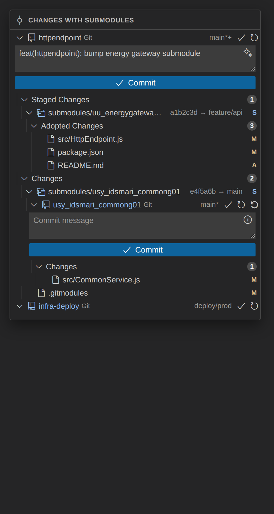

# Git Submodule Extension

<p align="center">
  
</p>

[](https://open-vsx.org/extension/qjohn/git-submodule-extension)
[](LICENSE)

VS Code extension for **hierarchical Git changes with submodules**: one SCM webview lists workspace repos and nested submodule checkouts, nests gitlink pointer diffs under the matching change row, and optionally restores submodule branches after parent Git operations (fail-closed).

Publisher: **`qjohn`**. Extension ID: **`qjohn.git-submodule-extension`**.



## Why

Monorepos and deployment layouts with nested submodules are hard to read in the flat built-in **Changes** panel. This extension adds **CHANGES with submodules** — same everyday Git vocabulary, but repositories nest under their gitlink parent and pointer moves show **Adopted Changes** (inner commit diffs) inline.

## Requirements

- VS Code `^1.85.0` (or a compatible fork such as Cursor)
- Built-in [Git extension](https://marketplace.visualstudio.com/items?itemName=vscode.git) (`vscode.git`)
- A Git binary on the host (path from `vscode.git`)

## Install

- **Open VSX** (after release): search *Git Submodule Extension* or install [`qjohn.git-submodule-extension`](https://open-vsx.org/extension/qjohn/git-submodule-extension).
- **VSIX**: download from [GitHub Releases](https://github.com/sedlacl/git-submodule-extension/releases) or build locally (`npm run package`), then *Extensions → … → Install from VSIX…*.

## What it shows

The built-in Git **Changes** panel cannot be replaced or hidden through a stable API — hide it manually from the SCM view title menu if you want this pane to be the daily driver.

This extension contributes an SCM webview named **CHANGES with submodules** that lists:

- workspace folders as sibling repositories (including multi-root workspaces), each with a clickable local branch label (`main*` unstaged, `+` staged, `!` merge) and an always-visible toolbar (Commit, Sync or Publish, Refresh); Checkout Branch, Fetch and Pull sit in the row context menu
- **Merge Changes**, **Staged Changes**, **Changes**, and (when `git.untrackedChanges` is `separate`) **Untracked Changes**, using built-in names, pill-shaped file counts, file icons, and M/A/D/R/U decorations; folders use a dirty dot; gitlink rows use `S`
- empty groups according to the same built-in settings (`git.alwaysShowStagedChangesResourceGroup`, `git.untrackedChanges`)
- gitlink pointer diffs nested under the matching **Staged Changes** / **Changes** row as **Adopted Changes** (`HEAD → index` staged, `index → checkout` unstaged), always shown with a pill file count (including `0`) and the inner commit file list. The gitlink row shows `S` and a gray `commit → branch` (or `commit → commit`) label. **View as List** / **View as Tree** (`scm.defaultViewMode`, plus `scm.compactFolders`) applies to those inner files as well
- nested submodules under their immediate gitlink parent, each with the same group layout
- collapsed repository names tinted with `gitDecoration.submoduleResourceForeground` when a descendant gitlink or child checkout has changes
- file rows that open `vscode.diff` (or `vscode.changes` for Open All)
- tree layout by default (`scm.defaultViewMode`); the view title toggles **View as List** / **View as Tree** and writes that setting so it applies globally

The pane is a `WebviewView` (not a second SCM view). It renders the same `AdoptedTreeNode` model as HTML: 22px rows, 8px indent, status letters, count pills, and `@vscode/codicons`. Row toolbar and context actions call the existing `gitSubmodule.*` commands. Expanded dirty repositories (own staged/unstaged/untracked files) show the commit textarea (`repository.inputBoxValue`), Generate Commit Message sparkle, and Commit button before their groups; collapsing the repository hides that chrome with its subtree while preserving the draft. The sparkle uses a public built-in/Copilot generate-commit-message command for the subject when one exists, then appends a submodule chore body from pointer diffs; without a public AI command it only generates that chore (or reports that there is nothing to generate). Expand state is kept while the view is hidden (`retainContextWhenHidden`).

Built-in labels, menu slots, and intentional deviations (webview vs SourceControl, no proposed SCM API, `gitSubmodule.*` command IDs, no file-icon theme / `view/item/context`) are documented in [`docs/builtin-git-parity.md`](docs/builtin-git-parity.md).

## Settings

| Setting | Default | Meaning |
| --- | --- | --- |
| `gitSubmodule.restore.enabled` | `true` | After parent Git checkout/commit/state-change events, run fail-closed branch restore. |
| `gitSubmodule.restore.debounceMs` | `250` | Coalesce bursty Git events before a restore pass (`0`–`10000`). |

The generated UI fixture workspace sets `gitSubmodule.restore.enabled` to `false` so detached/dirty scenarios stay visible. Product default remains **auto-safe on**.

## Commands

- **Git Submodule: Refresh** — reload the tree
- **Git Submodule: Retry Branch Restore** — explicit retry (never fetches)
- **Git Submodule: Fetch Submodule Remote** — `git fetch origin <branch>` after a modal confirmation; never runs automatically
- Open Changes / Open File / Open All Changes — tree item actions

Stage, unstage, discard, commit, refresh, sync, and publish use the owning repository's public `vscode.git` API handle. Destructive discard and conflict staging require confirmation. **Generate Submodule Chore** (the textarea sparkle) only prepares an editable commit message; it never stages or commits.

Blocked restore cases appear on the submodule row, in the **Git Submodule** output channel, and on the status bar.

## Output diagnostics

Open **View → Output**, then select **Git Submodule**. Every line uses one local wall-clock timestamp. Load lines retain `[changes #N]`: they identify one load generation and its trigger, bootstrap work, recursive discovery, tree build, serialization/post/render acknowledgement, total usable-tree time, result, and slowest phase. A separate `adopted counts` line reports background count hydration, including cache hits, Git diff calls, and the four-call concurrency bound. `stale/cancelled` means a newer generation replaced the load; it never represents a final tree.

User actions use a process-wide, monotonically increasing `[action #N]` id with monotonic durations. Each action has one start and exactly one `completed`, `cancelled`, or `failed` terminal line; concurrent actions remain attributable. Generate Message also reports its public AI command/provider result, submodule-chore preview count, and merge behavior without logging the generated text.

```text
[15:57:12.184] [action #14] generate message started (repository: web-app)
[15:57:12.612] [action #14] generate message AI 428ms (provider: git.generateCommitMessage; result: generated)
[15:57:12.640] [action #14] submodule chore preview 28ms (pointer updates: 2; result: generated)
[15:57:12.642] [action #14] generate message completed 458ms (merge: AI subject + appended chore; pointer updates: 2)
[15:59:00.100] [action #15] commit cancelled 1.20s (reason: empty message; staged: 2; unstaged: 0; smart commit: no)
```

Action coverage includes Generate Message/Submodule Chore, every stage/unstage/discard variant, commit, checkout, fetch, pull, sync, publish, refresh, retry restore, and explicit submodule-remote fetch. Open diff/file commands are omitted because they are high-frequency navigation and would add noise.

Action diagnostics include only repository basenames, counts, operation outcomes, smart-commit state, and useful branch/remote names. They never include commit-message text, file contents, authentication data, full remote URLs, environment values, or absolute repository paths. Error text is flattened, length-limited, and redacts credentials, authorization headers, and URLs.

## Security guarantees

Restore is fail-closed. Automatic work never does fetch, pull, push, commit, force, discard, or working-tree reset.

A child is attached (`git switch -C <branch> <pin>` plus upstream) only when all of these hold, re-checked immediately before the write:

- target branch comes from committed `HEAD:.gitmodules`
- target SHA comes from the current parent HEAD gitlink
- child is an initialized Git worktree at the declared path
- no Git operation is in progress
- working tree is clean
- `origin` exists
- the pin object and `origin/<branch>` exist locally
- the pin is an ancestor of `origin/<branch>`
- the local branch has no unique commits versus `origin/<branch>`

If any check fails, the child is left untouched and the reason is shown. Retry repeats the same checks. Fetch is a separate, confirmed command.

## Versioning

Bump `package.json` before every release (no git tag from npm by default):

```bash
npm run version:patch    # 0.1.0 → 0.1.1
npm run version:minor    # 0.1.0 → 0.2.0
npm run version:major    # 0.1.0 → 1.0.0
npm run version:set -- 0.1.0
```

Add a [CHANGELOG.md](CHANGELOG.md) entry, then tag `vX.Y.Z` and push. Open VSX publish runs in CI — see [`docs/publishing.md`](docs/publishing.md).

## Development

```bash
npm install
npm run build
npm run typecheck
npm run lint
npm test
npm run test:extension-host
npm run package
```

Regenerate the README screenshot from the webview HTML renderer (no signed-in IDE session):

```bash
npm run capture-readme-screenshot
```

### Isolated UI harness

`npm run dev:ui` starts esbuild watch and an Extension Development Host with an empty profile (`--user-data-dir` / `--extensions-dir` under `.vscode-test/`). Do not pass `--disable-extensions`: in Cursor it suppresses development extensions too and leaves the Changes view inactive. An empty `--extensions-dir` keeps user-installed marketplace extensions out while built-in Git and the development extension load normally.

```bash
npm run create-ui-fixture   # generate fixtures/ui if missing
npm run dev:ui:reset        # wipe and regenerate the fixture
npm run dev:ui              # VS Code engine from @vscode/test-electron
npm run dev:cursor          # same harness in Cursor (Electron app, not the CLI shim)
```

The harness opens `fixtures/ui/ui-dev.code-workspace` with local demo repositories only:

- a parent repo with two direct submodules and one nested checkout (staged/unstaged pointer, dirty, detached)
- an infra-style layout with repeated checkouts of the same sources under different path suffixes and branches
- plain top-level repos without submodules

Fixture remotes are local `file://` paths. Nothing touches real application repositories.

To try auto-restore in the harness, set `gitSubmodule.restore.enabled` to `true` in that workspace. To inspect the same layout in Cursor, use the same empty profile flags and `--extensionDevelopmentPath` (without `--disable-extensions`).

### Extension Development Host tests

`npm run test:extension-host` downloads the engine VS Code, opens the fixture workspace in an isolated profile, activates the extension, and checks contributed commands plus SCM refresh. It needs a desktop session that can launch VS Code.

## Current limits

- The built-in Git SCM provider cannot be extended or replaced; hide its Changes panel manually. This extension is a sibling tree in the SCM panel. See [`docs/builtin-git-parity.md`](docs/builtin-git-parity.md).
- Restore never updates gitlinks, never initializes missing submodules, and never fetches automatically.
- Nested restore walks committed gitlinks only, with a depth cap of 32 and cycle guards.
- Adopted file diffs compare commits inside the child repository; they are not a substitute for `git submodule update`.
- Real application workspaces should keep restore disabled until you have reviewed the tree (`gitSubmodule.restore.enabled: false`).

## Changelog

See [CHANGELOG.md](CHANGELOG.md).

## Upstream Git API

Public `vscode.git` types and change-group semantics are documented in
[`docs/vscode-git-api.md`](docs/vscode-git-api.md) (microsoft/vscode tag 1.96.0,
file `extensions/git/src/api/git.d.ts` at `d085816005ae61fc8f39b3720b3ec4594b35ecd0`).

## License

MIT — see [LICENSE](LICENSE).

## Repository

https://github.com/sedlacl/git-submodule-extension
